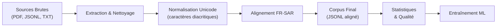

# Corpus Saar pour Machine Learning

## Description
Projet de création d'un corpus multilingue Français ↔ Saar pour entraîner des modèles de traduction et NLP.

## Objectifs
- [ ] **Phase 1** : Dataset de traduction Français ↔ Saar (Bible, Cosmogonie, Dictionnaire)
- [ ] **Phase 2** : Tokenizer personnalisé et gestion des caractères diacritiques Saar
- [ ] **Phase 3** : Annotation morphosyntaxique et sémantique
- [ ] **Phase 4** : Intégration audio (transcription/alignment)
- [ ] **Phase 5** : Dictionnaire annoté (lemmatisation, définitions)

## Structure du Projet

```
saar/
├── data/
│   ├── raw/                    # Données brutes (PDF, fichiers sources)
│   │   ├── sardc_bible.jsonl   # Versets bibliques structurés
│   │   ├── cosmogonie_sar.txt  # Texte de cosmogonie
│   │   └── sar_dictionary.pdf  # Dictionnaire (à extraire)
│   ├── processed/              # Données nettoyées et prêtes pour ML
│   │   ├── aligned_pairs.jsonl # Paires FR-SAR alignées
│   │   └── corpus_stats.json   # Statistiques du corpus
│   └── metadata/               # Métadonnées et annotations
│       ├── sources.json        # Infos sources
│       └── annotations/        # Annotations linguistiques
├── scripts/
│   ├── extract_bible.py        # Extraction Bible Saar
│   ├── extract_cosmogony.py    # Extraction Cosmogonie
│   ├── extract_dictionary.py   # Extraction Dictionnaire (nouveau)
│   ├── align_pairs.py          # Alignement FR-SAR
│   └── corpus_pipeline.py      # Pipeline complet
├── docs/
│   ├── SOURCES.md              # Documentation sources
│   ├── ENCODING.md             # Spécification encodage Saar
│   └── CONTRIBUTING.md         # Guide contribution
└── config.json                 # Configuration projet
```

## Sources Identifiées

### 1. Bible Saar (SARDC)
- **Format actuel** : JSONL (avec ref, book, chapter, verse, text)
- **Contenu** : ~32k versets en Saar
- **Statut** : ✅ Données brutes collectées
- **Localisation** : `data/raw/sardc_bible.jsonl`

### 2. Cosmogonie Saar
- **Format actuel** : TXT (texte brut extrait de PDF)
- **Contenu** : ~50 pages de texte rituel/mythologique
- **Statut** : ✅ Données extraites
- **Localisation** : `data/raw/cosmogonie_sar.txt`

### 3. Dictionnaire Saar
- **Format source** : PDF (à extraire)
- **Contenu** : Entrées lexicales avec traductions FR/SAR
- **Statut** : 🔄 À extraire
- **Localisation** : `data/raw/sar_dictionary.pdf`

## Pipeline de Traitement



## Quick Start

```bash
# 1. Extraire le dictionnaire
python scripts/extract_dictionary.py

# 2. Aligner les paires FR-SAR
python scripts/align_pairs.py

# 3. Générer le corpus final
python scripts/corpus_pipeline.py

# 4. Inspecter les statistiques
python -c "import json; stats = json.load(open('data/processed/corpus_stats.json')); print(stats)"
```

## Particularités du Saar

- **Système d'écriture** : Alphabet latin + caractères diacritiques spécifiques
- **Caractères spéciaux** : ɓ ɗ ə ɔ ɛ ḭ ḛ ṵ ā̰
- **Tonalité** : Importants pour la prononciation et le sens
- **Morphologie** : Langue synthétique avec affixes complexes

## Exigences

```
python >= 3.8
playwright
beautifulsoup4
pymupdf
jsonlines
```

## Licence

Données bibliques © Alliance Biblique du Tchad, 2006, 2010.
Autres contenus : à documenter selon source.

## Contact & Notes

- Corpus en construction
- Contributions bienvenues (voir CONTRIBUTING.md)
- Questions de licence à clarifier avec chaque source
